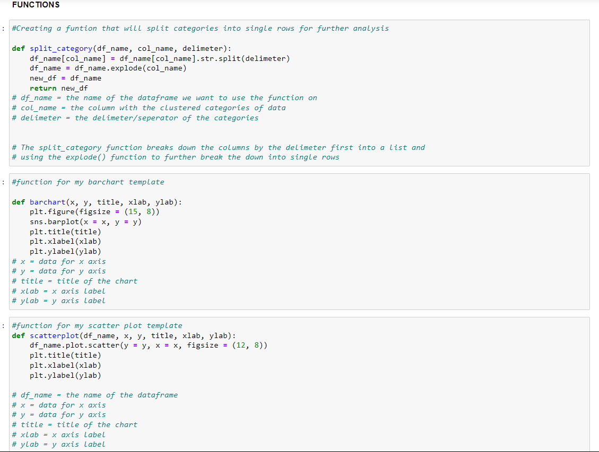

# TmDb Movie Dataset Analysis
## by Kola Ademola
___
 
___
## INTRODUCTION
___
This data set contains information about 10,866 movies collected from The Movie Database (TMDb), including user ratings and revenue. I will be doing an **Exploratory Data Analysis** on this dataset, it really helped me improved my wrangling and analytical skills.

### PROBLEM STATEMENT
What can we say about the success of a movie before it is released? Are there certain companies (Pixar?) that have found a consistent formula? Given that major films costing over $100 million to produce can still flop, this question is more important than ever to the industry. Film aficionados might have different interests. Can we predict which films will be highly rated, whether or not they are a commercial success?

This is a great place to start digging in to those questions, with data on the plot, cast, crew, budget, and revenues of several thousand films.
## Question(s) for Analysis  

1. Top 5 genre sell more/make the most profit?
2. Top 3 Directors with the most profitable movies?
3. Does high budget means high revenue?
4. Does longer runtime movies take up more budget?
5. Top 5 Production companies with the highest revenue?

___
## DATA SOURCING
___
This dataset is gotten from the [TmDb Kaggle page](https://www.kaggle.com/datasets/tmdb/themoviedb.org)
This dataset has multiple columns which consists of:

* id - unique movie id
* imdb_id - unique movie id on the imdb database
* popularity - movie popularity rating(not sure about this)
* budget - the cost of movie production
* revenue - money generated from the movie
* original_title - movie title
* cast - movie crew/cast
* homepage - web page of the movie
* director - movie director
* tagline - short sentence about the movie
* keywords - words that can be related to the movie
* overview - movie description
* runtime - movie duration in mins
* genres - movie genre
* production_companies - companies involved in production
* release_date - release date of movie
* vote_count - number of votes
* vote_average - average/mean of the votes
* release_year - release year of movie
* budget_adj - updated/adjusted budget
* revenue_adj - updated/adjusted revenue  
___
## SKILLS DEMONSTRATED & DATA TRANSFORMATION
___
I used multiple functions from the python and pandas library during the data wrangling & cleaning phase of this project, using the following libraries;

### Wrangling Process
After loading the dataset I took the following steps in my wrangling/cleaning process:
* I started by assessing the data visually & programmatically.
* I created a copy of the dataset before cleaning.
* I fixed all the data quality issues like: 
* wrong data types,

* missing values and

* also did some feature engneering for extra columns I needed for my analysis.

### Some Code Snippets used during Analysis

___

___

___

___

___
* Created some functions for the charts  visualizations I would use repeatedly

___
## CONCLUSIONS & RECCOMMENDATIONS
___
### Summary of Findings

After exploring the data and columns of interest this is the summary of my findings:
* ADVENTURE movies is the most profitable genre.

* STEVEN SPEILBERG comes out on top as the best movie director although this could also be because he has produced more movies.

* It can also be seen that theres a correlation between HIGH BUDGET and HIGH REVENUE but we cant assume causality as the correlation is not strong enough and there may be other variables involved;

And this is the same for LONG RUNTIME movies and HIGH BUDGET.

* Finally WARNER BROS comes out ontop as the best movie production company.

___
### RECCOMMENDATIONS
Some limitations of this analysis comes from the quality of the dataset because the dataset became short after the cleaning process as it had a lot of missing values in important columns(budget and revenue). A better/further analysis can be conducted with a much more accurate data.
